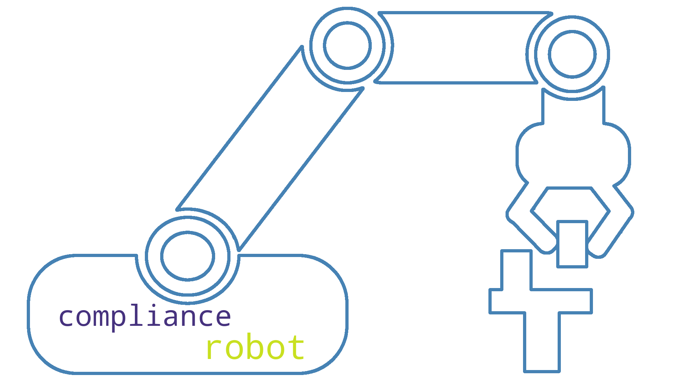

# Generate a Wordcloud from a bundle of PDFs



A (simple) script for generating wordcloud images and GIFs from PDF documents. This package was built using Python 3.8 and includes a miniconda installation `environment.yml` file.  

## Usage

Install the appropriate anaconda/miniconda software for your computer hardware. You could alternatively just install PyPDF2(https://github.com/mstamy2/PyPDF2) and the word_cloud(https://github.com/amueller/word_cloud) external repositories without having to create a conda environment. Place all PDFs you want to use for wordcloud generation into a ```pdfs/``` folder in the main directory. Also create an ```out/``` folder in the main directory. Run the following commands to install the conda environment to your computer and use:

``` 
    conda activate
    conda env create -f environment.yml
    conda activate wordcloud
    
    python main.py
```
Change parameters in the `params.yml` file according to desired output settings. Here you can change JPEG to GIF settings, sizes, colors, etc. Good luck and have fun!

## Contribute
Feel free to openly use and adapt this code however you and your project sees fit. Email Andy if you have any questions!

